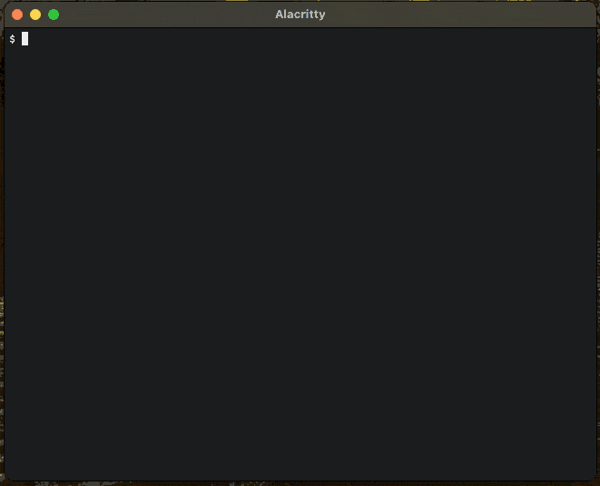

[](https://snapcraft.io/terminal-parrot) [](https://github.com/kz6fittycent/terminal-parrot/actions/workflows/test-snap-can-build.yml)

# :parrot: for your terminal


## Installing

Either grab a build on the [releases page](https://github.com/jmhobbs/terminal-parrot/releases) or clone and run...

```bash
$ go get -u github.com/jmhobbs/terminal-parrot
$ terminal-parrot
```

### Nix

#### nix-env

```bash
nix-env -i terminal-parrot
```

#### nix-profile

```bash
nix profile install nixpkgs#terminal-parrot
```
    
### Homebrew

There is a tap for this as well, it's `jmhobbs/parrot`

    brew tap jmhobbs/parrot
    brew install terminal-parrot
    
### Snap Install

```$ sudo snap install terminal-parrot```

The command will be installed as `parrot`, rather than `terminal-parrot`.

### Snap Install

```$ sudo snap install terminal-parrot```

### Docker

The image is available on [docker hub](https://hub.docker.com/r/jmhobbs/terminal-parrot/)

    docker pull jmhobbs/terminal-parrot
    docker run -it --rm jmhobbs/terminal-parrot:latest

You can also build a docker image locally and run it in a container with...

    docker build -t partyparrot ./
    docker run -it --rm partyparrot (-args)

### Quitting

Hit the escape or "q" key to quit.

### -loops

You can limit your parrots enthusiasm with the `-loops` flag.

### :fastparrot:

Set the frame delay with the `-delay` flag (defaults to 75, use 25 for :fastparrot:)

### :aussieparrot:

Use `-orientation aussie` for our friends down under.

## Adding Animations

You can add additional animations without re-compiling by adding a plain text file somewhere on the path (by default `/etc/terminal-parrot` or `/opt/homebrew/etc/terminal-parrot`).

This file should contain the frames, separated by lines containing `!--FRAME--!`.  The filename must end with `.animation`.

The first segment of the file is reserved for metadata, which is key-value pairs separated by `:`.

For example, the following file, named `test.animation` would add a new animation called `test`:

```
description: A test animation!
!--FRAME--!
[ Frame One ]
!--FRAME--!
[ Frame Two ]
!--FRAME--!
[ Frame Three ]
```

Then you can run `terminal-parrot test` to see your new animation (assuming it's on the path).



## Thanks

Idea from seeing [this tweet from @rachsmithtweets](https://twitter.com/rachsmithtweets/status/742785722290212868)

Thanks to [termbox-go](https://github.com/nsf/termbox-go) for making it easy.

Thanks to [jp2a](https://csl.name/jp2a/) for nice ASCII art conversion.

Thanks to [erinking](https://github.com/erinking) for [fixing colors and animation frames](https://github.com/jmhobbs/terminal-parrot/pull/15)

Thanks to [pdevine](https://github.com/pdevine) for the [Dockerfile](https://github.com/jmhobbs/terminal-parrot/pull/12) (and [robbyoconnor](https://github.com/robbyoconnor) for reviving the PR I let go stale)
